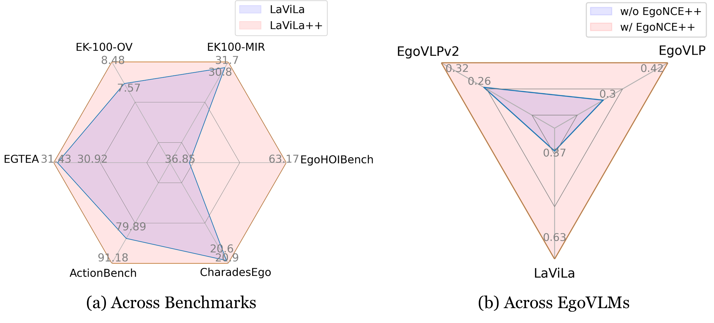
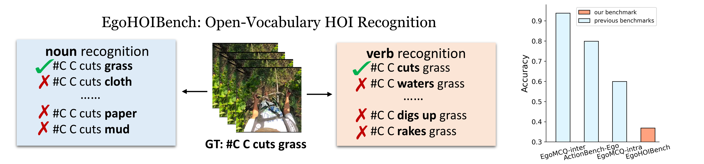

<h1 align="center">
  EgoNCE++: Do Egocentric Video-Language Models Really Understand Hand-Object Interactions?
</h1>

<figure align="center" style="width: 100%;">
  
  <figcaption> LaViLa pretrained using EgoNCE++ achieves remarkable improvements on six benchmarks, meanwhile EgoNCE++ universally enhances recognition ability on EgoHOIBench across EgoVLMs</figcaption>
</figure>

## Table of Contents
- [Overview](#overview)
- [Installation](#installation)
- [Datasets](#datasets)
- [Models](#models)

## Overview

(1) We developed EgoHOIBench, a benchmark specifically designed to evaluate models' capabilities in fine-grained and open-vocabulary EgoHOI comprehension.

(2) We propose EgoNCE++, an innovative HOI-aware asymmetric contrastive learning objective for egocentric video-language pretraining.

(3) Our experimental results demonstrate that EgoNCE++ can be applied to various EgoVLMs, notably improving generalization across six downstream EgoHOI tasks, especially in zero-shot settings.

## Installation

The environment depends on the pretrained models. 
We organize all possible preparations in [INSTALL.md](docs/INSTALL.md) according to the codebases.

## Datasets
The dataset preparation details are provided in in [DATASET.md](./docs/DATASET.md).

Our annotations from Ego4D are outlined here.

### EgoHOI2.5M

We continue to pretrain the EgoVLMs (e.g. EgoVLP, EgoVLPv2, LaViLa) on the EgoHOI2.5M. 
The Different types of negatives can be found in [EgoHOI2.5M-anonymous](https://www.dropbox.com/scl/fo/hjbrg6ut7tnfg02ni7y3e/AMy7rlr7LR2Ablk2TnpWSG8?rlkey=fsy4wrvs1p1422uhu2ntg7zie&st=31ye3mpj&dl=0)

### EgoHOIBench 
EgoHOIBench includes ~29K videos and ~609K text options.

The annotations can be found in [EgoHOIBench-anonymous](https://www.dropbox.com/scl/fo/d14p2yv3r5qww5xhif43k/ADt5Or05GJ2Y8BhuvTht1Jg?rlkey=dd1mec089j7alilz0df54t4wf&st=b47ake0n&dl=0)

<figure align="center" style="width: 100%;">
  
  <figcaption> Illustration of EgoHOIBench and the performance drop on our benchmark.</figcaption>
</figure>

## Models

MODEL++ denotes using EgoNCE++ to continue to pretrain the original MODEL.

<table class="tg"><thead>
  <tr>
    <th class="tg-af47" rowspan="2">Models　 　</th>
    <th class="tg-af47" colspan="3">EgoHOIBench</th>
    <th class="tg-af47" colspan="2">EK-100-MIR</th>
    <th class="tg-af47" rowspan="2">checkpoint</th>
  </tr>
  <tr>
    <th class="tg-n9g5">verb</th>
    <th class="tg-n9g5">noun</th>
    <th class="tg-n9g5">action</th>
    <th class="tg-n9g5">mAP</th>
    <th class="tg-n9g5">nDCG</th>
  </tr></thead>
<tbody>
  <tr>
    <td class="tg-n9g5">EgoVLP</td>
    <td class="tg-n9g5">40.27</td>
    <td class="tg-n9g5">68.6</td>
    <td class="tg-n9g5">30.16</td>
    <td class="tg-n9g5">22.2</td>
    <td class="tg-n9g5">26.7</td>
    <td class="tg-n9g5">TBD</td>
  </tr>
  <tr>
    <td class="tg-f39b">EgoVLP++</td>
    <td class="tg-f39b">56.11</td>
    <td class="tg-f39b">69.05</td>
    <td class="tg-f39b">41.63</td>
    <td class="tg-f39b">22.7</td>
    <td class="tg-f39b">27.1</td>
    <td class="tg-f39b">TBD</td>
  </tr>
  <tr>
    <td class="tg-n9g5">EgoVLPv2</td>
    <td class="tg-n9g5">36.1</td>
    <td class="tg-n9g5">63.4</td>
    <td class="tg-n9g5">26.4</td>
    <td class="tg-n9g5">23.4</td>
    <td class="tg-n9g5">27.8</td>
    <td class="tg-n9g5">TBD</td>
  </tr>
  <tr>
    <td class="tg-f39b">EgoVLPv2++</td>
    <td class="tg-f39b">44.41</td>
    <td class="tg-f39b">64.1</td>
    <td class="tg-f39b">32.4</td>
    <td class="tg-f39b">23.9</td>
    <td class="tg-f39b">28.3</td>
    <td class="tg-f39b">TBD</td>
  </tr>
  <tr>
    <td class="tg-n9g5">LaViLa</td>
    <td class="tg-n9g5">46.61</td>
    <td class="tg-n9g5">74.33</td>
    <td class="tg-n9g5">36.85</td>
    <td class="tg-n9g5">30.8</td>
    <td class="tg-n9g5">32</td>
    <td class="tg-n9g5">TBD</td>
  </tr>
  <tr>
    <td class="tg-f39b">LaViLa++</td>
    <td class="tg-f39b">80.63</td>
    <td class="tg-f39b">75.30</td>
    <td class="tg-f39b">63.17</td>
    <td class="tg-f39b">31.7</td>
    <td class="tg-f39b">32.3</td>
    <td class="tg-f39b">TBD</td>
  </tr>
</tbody></table>