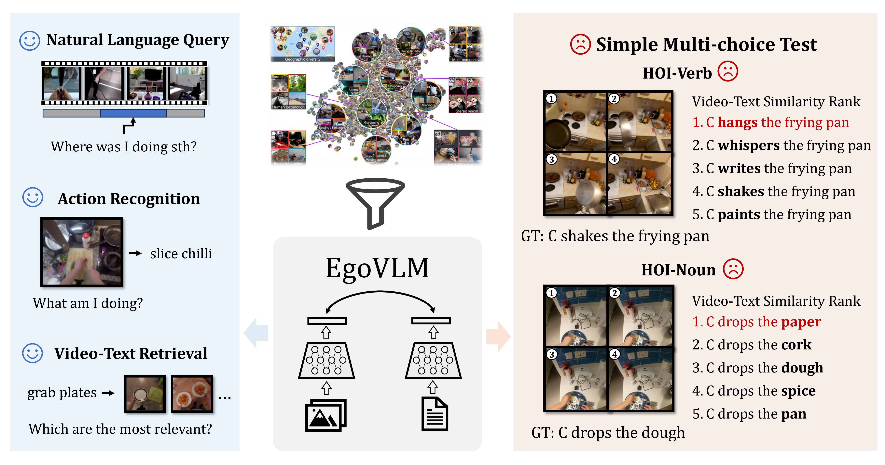
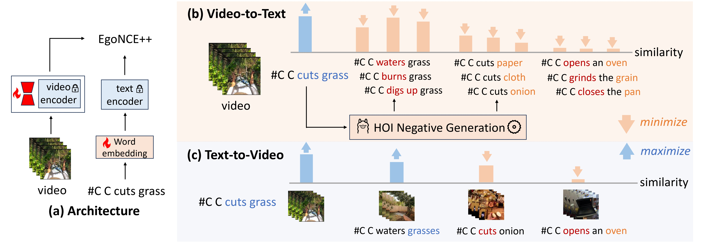
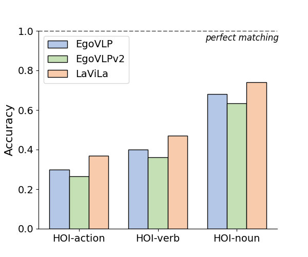
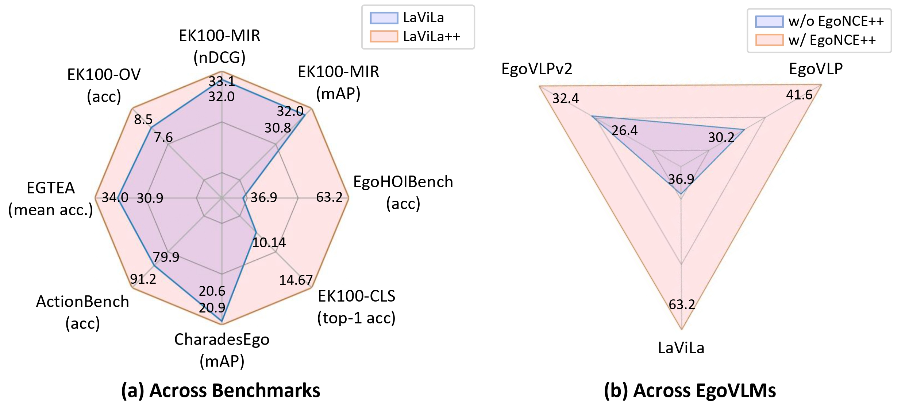

<h1 align="center">
  Do Egocentric Video-Language Models Truly Understand Hand-Object Interactions?
</h1>


<figure align="center" style="width: 100%;">
  
  <figcaption> Although EgoVLMs have been pretrained on millions of worldwide egocentric videos and applied to challenging downstream tasks like video-text retrieval, we observe that they often fail to select the matched sentence from the simplest word substituted candidates for videos. </figcaption>
</figure>

## Table of Contents
- [Overview](#overview)
- [Installation](#installation)
- [Datasets](#datasets)
- [Models](#models)


## Overview

(1) We develop **EgoHOIBench**, a novel benchmark specifically designed to evaluate EgoVLMs' capabilities in understanding variations of HOI combination.

(2) We propose **EgoNCE++**, an innovative HOI-aware asymmetric contrastive learning objective for egocentric video-language pretraining.

(3) Our experimental results demonstrate the versatility and efficacy of EgoNCE++, notably enhancing performance across three EgoVLMs and improving generalization on seven downstream EgoHOI tasks.

## Implementation Difference between EgoNCE++ and InfoNCE


<figure align="center" style="width: 100%;">
  
  <figcaption>  </figcaption>
</figure>

EgoNCE++ can be implemented with ease.

```python
class EgoNCEpp(nn.Module):
    def __init__(self, temperature=0.05):
        super().__init__()
        self.temperature = temperature
    def forward(self, video_embeds, pos_txt, neg_txt=None, n_embeds=None):
        pos_sim = sim_matrix(pos_txt, video_embeds)
++      if neg_txt is not None and n_embeds is not None:
++          sim_n = n_embeds @ n_embeds.T
++          neg_sim = sim_matrix(neg_txt, video_embeds)
++          return self.get_loss(pos_sim, neg_sim, sim_n)
++      else:
            return self.get_loss(pos_sim)
    def get_loss(self, pos_sim, neg_sim=None, mask_n=None):
        '''
        inputs:
            pos_sim: is similarity matrix of N x N, computed using the cosine similarity between normalised vectors
            neg_sim: is similarity matrix of (Neg_Number)*N x N
        '''
        mask = torch.eye(pos_sim.shape[0]).cuda()
        # text-to-video object-centric positive sampling
++      mask = mask_n + mask

        i_sm = F.softmax(pos_sim / self.temperature, dim=1)
        mask_bool = mask > 0
        i_mask = torch.zeros(i_sm.shape).to(mask_bool.device) + 1e-6
        i_mask[:mask_bool.shape[0], :mask_bool.shape[1]] = mask_bool
        idiag = torch.log(torch.sum(i_sm * i_mask, dim=1))
        loss_t2v = idiag.sum() / len(idiag)

        # video-to-text HOI-aware negative generation
++      if neg_sim is not None:
++          neg_num, video_num = neg_sim.shape[0] // neg_sim.shape[1], neg_sim.shape[1]
++          neg_sim = torch.stack([neg_sim[i * neg_num: (i + 1) * neg_num, i] for i in range(video_num)], dim=1)

++          pos_sim = torch.cat([pos_sim, neg_sim], dim=0)
        j_logsm = F.log_softmax(pos_sim.t()/self.temperature, dim=1)
        jdiag = torch.diag(j_logsm)
        loss_v2t = jdiag.sum() / len(jdiag)

        return - loss_t2v - loss_v2t

```


## Installation

The environment depends on the pretrained EgoVLM, see corresponding installation docs. 


## Datasets
The dataset preparation details are provided in in [DATASET.md](./docs/DATASET.md).

Our annotations from Ego4D are outlined here.

### EgoHOI2.5M

We continue to pretrain the EgoVLMs (e.g. EgoVLP, EgoVLPv2, LaViLa) on the EgoHOI2.5M. 
The Different types of negatives can be found in [EgoHOI2.5M-anonymous](https://www.dropbox.com/scl/fo/hjbrg6ut7tnfg02ni7y3e/AMy7rlr7LR2Ablk2TnpWSG8?rlkey=fsy4wrvs1p1422uhu2ntg7zie&st=31ye3mpj&dl=0)

### EgoHOIBench 
EgoHOIBench includes ~29K videos and ~609K text options.

The annotations can be found in [EgoHOIBench-anonymous](https://www.dropbox.com/scl/fo/d14p2yv3r5qww5xhif43k/ADt5Or05GJ2Y8BhuvTht1Jg?rlkey=dd1mec089j7alilz0df54t4wf&st=b47ake0n&dl=0)

<figure align="center" style="width: 100%;">
  
  <figcaption> Illustration of EgoHOIBench and the performance drop on our benchmark.</figcaption>
</figure>

## Models

MODEL++ denotes using EgoNCE++ to continue to pretrain the original MODEL.

<figure align="center" style="width: 100%;">
  
  <figcaption> Overview of experimental results. </figcaption>
</figure>


<!-- 
<table class="tg"><thead>
  <tr>
    <th class="tg-af47" rowspan="2"><span style="font-weight:normal">Models　</span><br><span style="font-weight:normal">　</span></th>
    <th class="tg-af47" colspan="3"><span style="font-weight:normal">EgoHOIBench</span></th>
    <th class="tg-af47" colspan="2"><span style="font-weight:normal">EK-100-MIR</span></th>
    <th class="tg-af47" rowspan="2"><span style="font-weight:normal">checkpoint</span></th>
  </tr>
  <tr>
    <th class="tg-n9g5"><span style="font-weight:normal">verb</span></th>
    <th class="tg-n9g5"><span style="font-weight:normal">noun</span></th>
    <th class="tg-n9g5"><span style="font-weight:normal">action</span></th>
    <th class="tg-n9g5"><span style="font-weight:normal">mAP</span></th>
    <th class="tg-n9g5"><span style="font-weight:normal">nDCG</span></th>
  </tr></thead>
<tbody>
  <tr>
    <td class="tg-n9g5">EgoVLP</td>
    <td class="tg-n9g5">40.27</td>
    <td class="tg-n9g5">68.6</td>
    <td class="tg-n9g5">30.16</td>
    <td class="tg-n9g5">22.2</td>
    <td class="tg-n9g5">26.7</td>
    <td class="tg-n9g5">TBD</td>
  </tr>
  <tr>
    <td class="tg-f39b">EgoVLP++</td>
    <td class="tg-f39b">56.11</td>
    <td class="tg-f39b">69.05</td>
    <td class="tg-f39b">41.63</td>
    <td class="tg-f39b">22.7</td>
    <td class="tg-f39b">27.1</td>
    <td class="tg-f39b">TBD</td>
  </tr>
  <tr>
    <td class="tg-n9g5">EgoVLPv2</td>
    <td class="tg-n9g5">36.1</td>
    <td class="tg-n9g5">63.4</td>
    <td class="tg-n9g5">26.4</td>
    <td class="tg-n9g5">23.4</td>
    <td class="tg-n9g5">27.8</td>
    <td class="tg-n9g5">TBD</td>
  </tr>
  <tr>
    <td class="tg-f39b">EgoVLPv2++</td>
    <td class="tg-f39b">44.41</td>
    <td class="tg-f39b">64.1</td>
    <td class="tg-f39b">32.4</td>
    <td class="tg-f39b">23.9</td>
    <td class="tg-f39b">28.3</td>
    <td class="tg-f39b">TBD</td>
  </tr>
  <tr>
    <td class="tg-n9g5">LaViLa</td>
    <td class="tg-n9g5">46.61</td>
    <td class="tg-n9g5">74.33</td>
    <td class="tg-n9g5">36.85</td>
    <td class="tg-n9g5">30.8</td>
    <td class="tg-n9g5">32</td>
    <td class="tg-n9g5">TBD</td>
  </tr>
  <tr>
    <td class="tg-f39b">LaViLa++</td>
    <td class="tg-f39b">80.63</td>
    <td class="tg-f39b">75.30</td>
    <td class="tg-f39b">63.17</td>
    <td class="tg-f39b">31.7</td>
    <td class="tg-f39b">32.3</td>
    <td class="tg-f39b">TBD</td>
  </tr>
</tbody></table> -->

## Acknowledgement

We are grateful for the following projects:
EgoVLP, EgoVLPv2, LaViLa, where we build our EgoNCE++ upon.